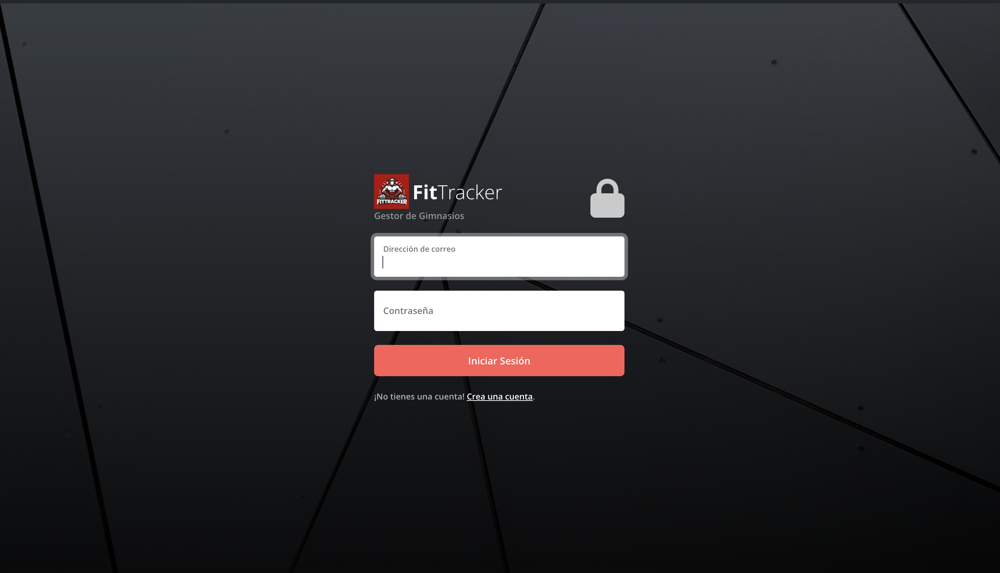
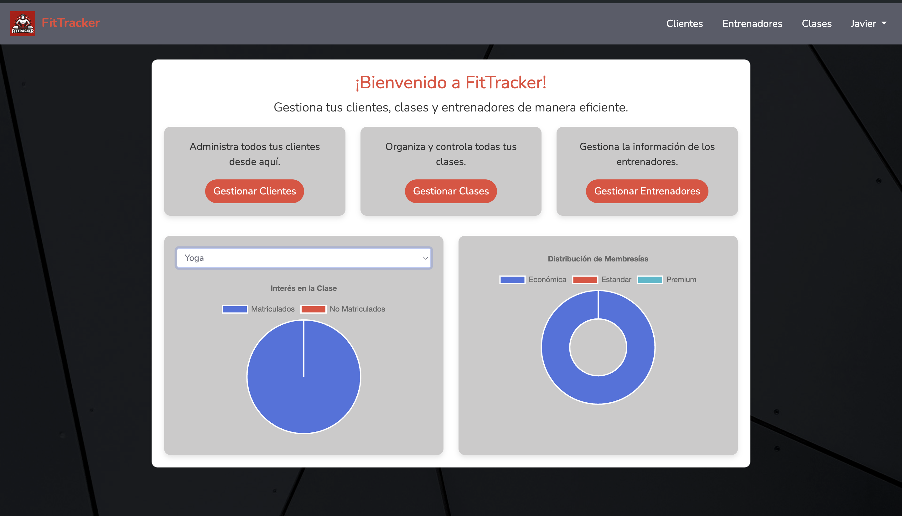
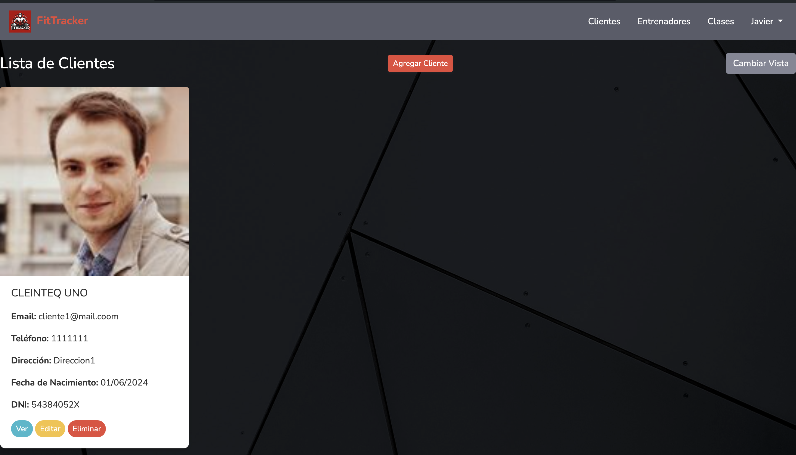
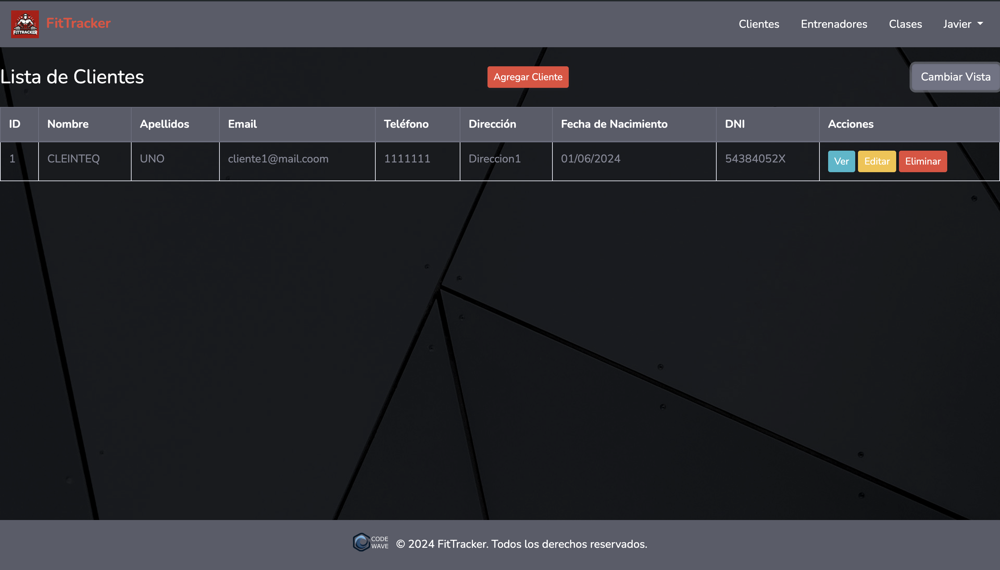
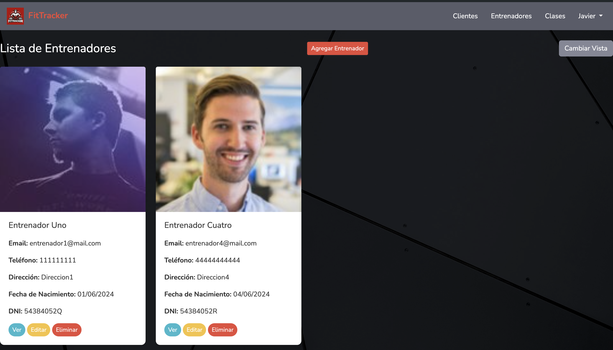
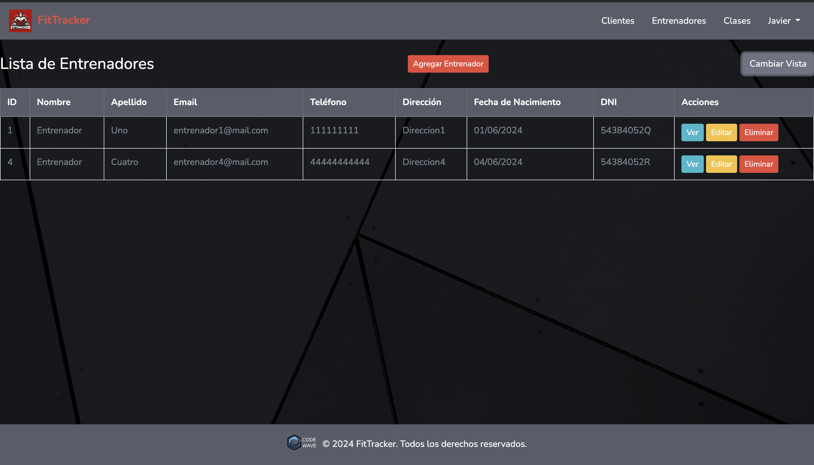
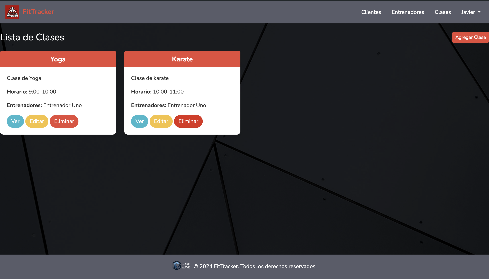

<p align="center">
    <a href="https://laravel.com" target="_blank">
        
    </a>
</p>

<p align="center">
    <a href="https://github.com/laravel/framework/actions">
        
    </a>
    <a href="https://packagist.org/packages/laravel/framework">
        
    </a>
    <a href="https://packagist.org/packages/laravel/framework">
        
    </a>
    <a href="https://packagist.org/packages/laravel/framework">
        
    </a>
</p>

# 🏋️‍♂️🏋️‍♀️ FITTRACKER 🏋️‍♂️🏋️‍♀️

Este proyecto es un sistema de gestión de gimnasios (ERP) desarrollado con Laravel y Bootstrap como parte de mi módulo proyecto de DAM. Permite realizar operaciones CRUD para gestionar clientes, clases y entrenadores, con autenticación implementada usando Laravel Breeze.

## ✨ Características

- 👥 Gestión de clientes
- 🏋️‍♂️ Gestión de clases
- 🧑‍🏫 Gestión de entrenadores
- 🔐 Autenticación y autorización
- 📱 Interfaz de usuario responsiva con Bootstrap

## 🛠️ Tecnologías

- **Laravel**: Framework de PHP para backend.
- **Laravel Breeze**: Para la implementación de autenticación.
- **Bootstrap**: Framework CSS para frontend.

## 📸 Capturas de Pantalla

<p align="center">
    
    
    
</p>
<p align="center">
    
    
    
    
</p>

## ⚙️ Instalación

Sigue estos pasos para instalar y configurar el proyecto en tu entorno local.

1. Clona el repositorio:
    ```sh
    git clone https://github.com/tu_usuario/tu_repositorio.git
    cd tu_repositorio
    ```

2. Instala las dependencias de PHP:
    ```sh
    composer install
    ```

3. Copia el archivo `.env.example` a `.env` y configura tu entorno:
    ```sh
    cp .env.example .env
    ```

4. Genera la clave de la aplicación:
    ```sh
    php artisan key:generate
    ```

5. Configura tu base de datos en el archivo `.env`.

6. Ejecuta las migraciones y los seeders:
    ```sh
    php artisan migrate --seed
    ```

7. Instala las dependencias de Node.js y compila los assets:
    ```sh
    npm install
    npm run dev
    ```

8. Inicia el servidor local:
    ```sh
    php artisan serve
    ```

## 🤝 Contribuir

¡Las contribuciones son bienvenidas! Si deseas contribuir a este proyecto, por favor sigue estos pasos:

1. Realiza un fork del proyecto.
2. Crea una rama para tu característica (`git checkout -b feature/nueva-caracteristica`).
3. Realiza los cambios necesarios y haz commit (`git commit -am 'Agrega nueva característica'`).
4. Sube los cambios a tu repositorio (`git push origin feature/nueva-característica`).
5. Abre una solicitud de pull en GitHub.

## 🔒 Seguridad

Si encuentras algún problema de seguridad, por favor repórtalo enviando un correo a [javigongimenez@gmail.com](mailto:javigongimenez@gmail.com)

## 📄 Licencia

Este proyecto está licenciado bajo la Licencia MIT.
